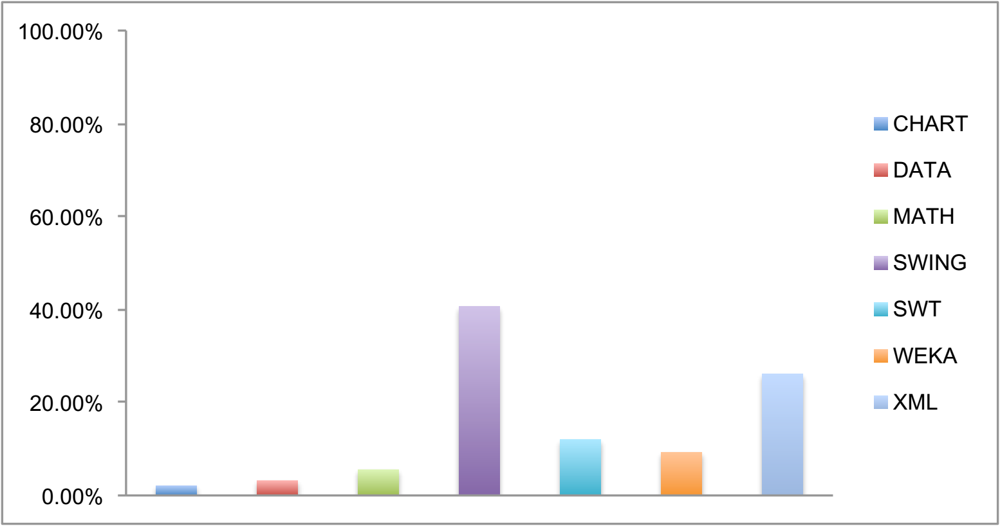
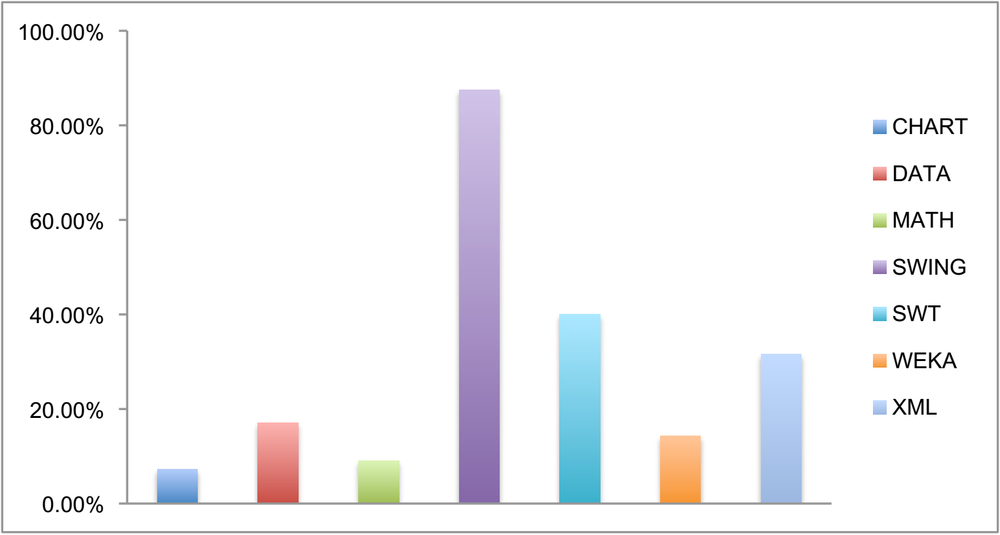

##### 1-Level Control Flow Analysis (1-CFA)
If a parameter of a procedure is directly passed to an API, the existing mining approach cannot mine precondition for that API due to absence of calling context. Performing single level context sensitive analysis to infer preconditions for such cases can benefit in mining more preconditions. This component takes advantage of both implicit belief related conditions and explicit conditions from the caller methods if such conditions are within context. All libraries of interest shows rise in terms of both precision and recall.

Improvement in precision

Improvement in recall

